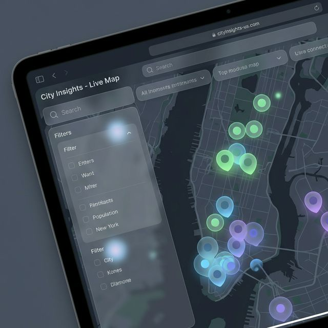
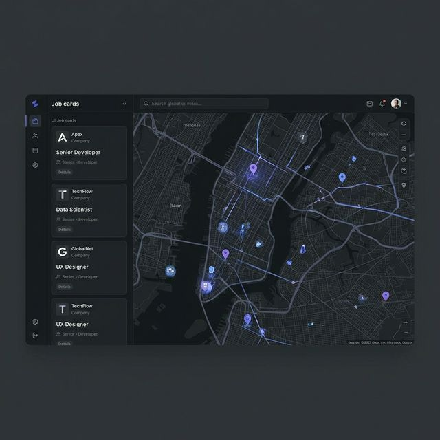

<div align="center">

# LinkedIn Job Map

### See your job search. Literally.

A Chrome Extension that brings LinkedIn job listings to life on an interactive, dark-themed map -- so you can finally understand *where* the jobs are, not just what they are.

[](https://chrome.google.com/webstore/detail/placeholder)
[](LICENSE)
[](tests/)
[](coverage/)
[](https://developer.chrome.com/docs/extensions/mv3/)
[](https://www.linkedin.com/jobs/)

<p>
  <b>English</b> | <a href="README.tr.md">Turkce</a>
</p>

<br/>


<br/>

*Marker clustering, color-coded workplace types, commute estimation, and a beautiful glassmorphism UI -- all inside your LinkedIn tab.*

</div>

---

## Features

- **Interactive Map Overlay** -- Full Leaflet.js map with dark Mapbox tiles, rendered directly inside your LinkedIn jobs page
- **Marker Clustering** -- Hundreds of jobs grouped intelligently; zoom in to reveal individual pins
- **Workplace Type Filtering** -- Toggle On-site (blue), Hybrid (green), and Remote (purple) with live counts on each chip
- **Text Search** -- Debounced real-time search across job titles, companies, and locations
- **Smart Sorting** -- Sort by distance from your location, company name, workplace type, or posting date
- **Company Logos** -- Pulled directly from LinkedIn's API with graceful initial-letter fallbacks
- **Job Posting Dates** -- Relative timestamps ("2d ago", "1w ago") displayed on cards and map popups
- **CSV Export** -- Download all mapped jobs as a UTF-8 CSV file with one click
- **Keyboard Shortcuts** -- Navigate the job list without touching your mouse
- **Commute Estimation** -- Distance-based travel time zones (urban, suburban, highway) for realistic estimates
- **Bidirectional Sync** -- Click a job card and the map flies to it; click a map pin and the card highlights
- **Fullscreen Mode** -- Expand the map to fill the entire viewport with a slide-out job panel
- **GPS & Click Location** -- Set your location via GPS or by clicking anywhere on the map
- **OSRM Routing** -- Real driving/cycling route overlay between your location and any job
- **Bilingual UI** -- Full English and Turkish interface, auto-detected from browser language
- **Dark Glassmorphism Theme** -- A polished, modern design that feels native to LinkedIn's dark mode
- **Cache Management** -- Geocoding results cached locally; clear per-job or all caches from the header
- **Custom Mapbox Token** -- Use the built-in token or configure your own for higher rate limits

---

## Screenshots

<div align="center">
<table>
<tr>
<td align="center" width="50%">
<br/>
<strong>Map Overview</strong><br/>
<sub>All jobs plotted with marker clustering</sub>
</td>
<td align="center" width="50%">
<br/>
<strong>Fullscreen Mode</strong><br/>
<sub>Card-based job panel with filter bar</sub>
</td>
</tr>
<tr>
<td align="center">
<br/>
<strong>Filtering & Search</strong><br/>
<sub>Color-coded workplace type chips with counts</sub>
</td>
<td align="center">
<br/>
<strong>Route & Commute</strong><br/>
<sub>OSRM routing with estimated travel time</sub>
</td>
</tr>
</table>
</div>


---

## Installation

### From Chrome Web Store (Recommended)

1. Visit the [LinkedIn Job Map](https://chrome.google.com/webstore/detail/placeholder) listing on the Chrome Web Store
2. Click **Add to Chrome**
3. Navigate to any [LinkedIn Jobs search page](https://www.linkedin.com/jobs/) and click the **Open Job Map** button that appears

### Manual Installation (Developer Mode)

1. **Download** this repository:
   ```bash
   git clone https://github.com/ofurkanuygur/linkedin-job-map.git
   ```
2. Open Chrome and navigate to `chrome://extensions`
3. Enable **Developer mode** (toggle in the top-right corner)
4. Click **Load unpacked** and select the cloned `linkedin-job-map` folder
5. Navigate to any [LinkedIn Jobs search page](https://www.linkedin.com/jobs/) -- the extension activates automatically

---

## Usage

1. **Search for jobs** on LinkedIn as you normally would (`linkedin.com/jobs/...`)
2. A floating **"Open Job Map"** button appears at the bottom of the page
3. Click it to open the map panel -- jobs are automatically fetched, geocoded, and plotted
4. **Set your location** by clicking the GPS button or clicking directly on the map
5. **Filter** by workplace type using the colored chips (On-site / Hybrid / Remote)
6. **Search** by typing in the search bar to filter by title, company, or location
7. **Sort** using the dropdown (Distance, Company, Type, Date)
8. **Click any job card** to fly to its location on the map, or click a **map marker** to highlight the card
9. **View Job** opens the full LinkedIn posting; **Maps** opens the location in Google Maps
10. Press the **fullscreen** button for a distraction-free, immersive map experience
11. **Export** your results as CSV for external analysis

---

## Configuration

### Mapbox Access Token

The extension ships with a default Mapbox token that works out of the box. For heavy usage or higher rate limits, you can provide your own:

1. Create a free account at [mapbox.com](https://www.mapbox.com/)
2. Copy your **default public token** from the [tokens page](https://account.mapbox.com/access-tokens/)
3. Right-click the LinkedIn Job Map extension icon in Chrome and select **Options**
4. Paste your token and click **Save**
5. Use the **Test Token** button to verify it works
6. Reload your LinkedIn tab to apply the new token

> The free Mapbox tier includes 100,000 geocoding requests/month, which is more than sufficient for typical job searches.

---

## Tech Stack

| Component | Technology |
|---|---|
| Extension Platform | Chrome Extension Manifest V3 |
| Map Engine | [Leaflet.js](https://leafletjs.com/) |
| Marker Clustering | [Leaflet.markercluster](https://github.com/Leaflet/Leaflet.markercluster) |
| Map Tiles | [Mapbox](https://www.mapbox.com/) (Dark theme) |
| Geocoding | [Mapbox Geocoding API](https://docs.mapbox.com/api/search/geocoding/) |
| Routing | [OSRM](https://project-osrm.org/) (Open Source Routing Machine) |
| Job Data | LinkedIn Voyager API (internal, via content script) |
| UI Design | Custom CSS with glassmorphism effects |
| Internationalization | Custom `t()` helper with template substitution |

---

## Keyboard Shortcuts

| Key | Action |
|---|---|
| `Esc` | Close the map panel or exit fullscreen |
| `Up Arrow` | Navigate to the previous job card |
| `Down Arrow` | Navigate to the next job card |
| `Enter` | Open the selected job's LinkedIn posting |

> Keyboard shortcuts are automatically disabled when a text input field is focused.

---

## Privacy

LinkedIn Job Map is built with privacy as a core principle:

- **No data collection** -- Zero analytics, telemetry, or tracking of any kind
- **No external servers** -- All processing happens locally in your browser
- **No account required** -- The extension works immediately after installation
- **Local caching only** -- Geocoding results are stored in your browser's `localStorage` and never transmitted
- **Minimal permissions** -- Only requests `activeTab` and `storage`; network access is limited to Mapbox (geocoding/tiles) and OSRM (routing)

---

## Code Quality

This project uses **Vitest** for testing and **SonarQube** for static analysis.

### Test Coverage

| Metric | Coverage |
|---|---|
| **Statements** | 26.23% |
| **Branches** | 90.14% |
| **Functions** | 15.78% |
| **Lines** | 27.4% |
| **Tests** | 48 passed, 0 failed |

> Branch coverage is prioritized at **90%+** to ensure all conditional logic paths are thoroughly tested.

### Running Tests

```bash
npm install
npm test                # Run tests
npm run test:coverage   # Run with coverage report
```

### SonarQube Analysis

```bash
cp .env.example .env    # Edit SONAR_TOKEN value
npm run sonar:full      # Start SonarQube via Docker + run scan
```

See the [SonarQube Documentation](https://docs.sonarqube.org/latest/) for detailed setup.

---

## Contributing

Contributions are welcome! Here's how to get started:

1. **Fork** this repository
2. **Create a feature branch** (`git checkout -b feature/amazing-feature`)
3. **Make your changes** and test them on a LinkedIn Jobs page
4. **Commit** your changes (`git commit -m 'Add amazing feature'`)
5. **Push** to your branch (`git push origin feature/amazing-feature`)
6. **Open a Pull Request** with a clear description of what you changed and why

### Development Notes

- The entire content script is wrapped in an IIFE to avoid global scope pollution
- `content.js` (~1,800 lines) contains all map, UI, and API logic
- `styles.css` (~1,000 lines) handles the dark glassmorphism theme
- Test changes by reloading the extension at `chrome://extensions` and refreshing a LinkedIn Jobs page

---

## License

This project is licensed under the **MIT License** -- see the [LICENSE](LICENSE) file for details.

---

<div align="center">

<br/>

Built with **LinkedIn Job Map** -- Visualize your job search on a map.

</div>
